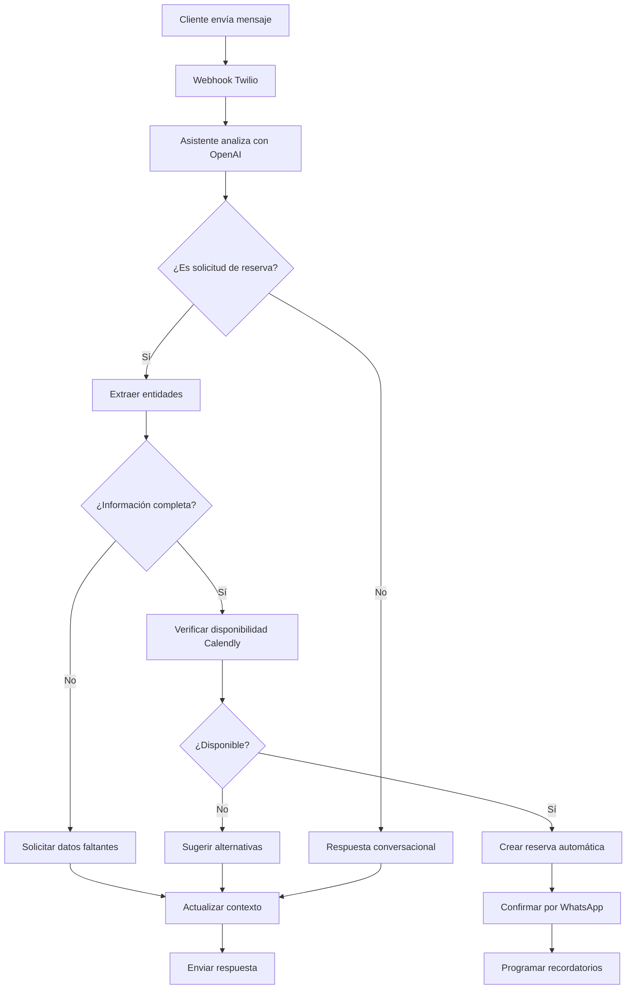
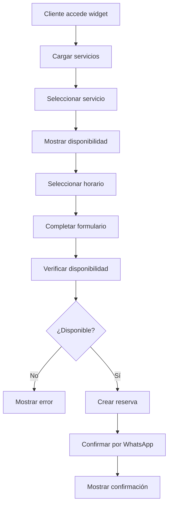

# 📚 DOCUMENTACIÓN TÉCNICA - ASISTENTE VIRTUAL AUTÓNOMO

## 🎯 **RESUMEN EJECUTIVO**

### Objetivo

Sistema de asistente virtual autónomo que gestiona reservas en Calendly sin intervención humana, integrado con WhatsApp (Twilio) y portal web (ricardoburitica.eu).

### Características Principales

- ✅ **Asistente IA Conversacional** - OpenAI GPT-4 para procesamiento de lenguaje natural
- ✅ **Reservas Automáticas** - Integración directa con Calendly API
- ✅ **WhatsApp Business** - Canal principal de comunicación via Twilio
- ✅ **Widget Web Embebido** - Para ricardoburitica.eu
- ✅ **Confirmaciones Automáticas** - Por WhatsApp y email
- ✅ **Recordatorios Programados** - 24h, 2h, 30min antes de la cita
- ✅ **Escalabilidad Profesional** - Infraestructura en Railway

## 🏗️ **ARQUITECTURA DEL SISTEMA**

### Stack Tecnológico

```yaml
Backend:
  - Runtime: Node.js 18+
  - Framework: Express.js
  - Database: PostgreSQL (Railway)
  - Authentication: JWT + Refresh Tokens

AI & Integrations:
  - AI: OpenAI GPT-4 Turbo
  - WhatsApp: Twilio Business API
  - Calendar: Calendly API v2
  - Notifications: Multi-channel

Infrastructure:
  - Hosting: Railway
  - Database: PostgreSQL (Railway)
  - Domain: api.ricardoburitica.eu
  - SSL: Automatic (Railway)
  - Monitoring: Railway Metrics + Logs
```

### Componentes Principales

#### 1. **Asistente Autónomo** (`src/services/autonomousAssistant.js`)

```javascript
Funcionalidades:
- Análisis de intenciones con OpenAI
- Extracción de entidades (servicio, fecha, hora, cliente)
- Verificación de disponibilidad en Calendly
- Creación automática de reservas
- Gestión de contexto conversacional
- Escalación automática cuando necesario
```

#### 2. **Controlador WhatsApp** (`src/controllers/autonomousWhatsAppController.js`)

```javascript
Endpoints:
- POST /autonomous/whatsapp/webhook - Recibir mensajes
- POST /autonomous/whatsapp/status - Estados de mensajes
- GET /autonomous/whatsapp/health - Health check
- GET /autonomous/whatsapp/stats - Estadísticas
- GET /autonomous/whatsapp/conversations - Conversaciones activas
```

#### 3. **Widget de Reservas** (`src/services/bookingWidgetService.js`)

```javascript
Funcionalidades:
- Servicios disponibles para widget
- Verificación de disponibilidad
- Creación de reservas desde web
- Gestión de reservas del cliente
- Cancelaciones con políticas
```

#### 4. **Controlador Widget** (`src/controllers/bookingWidgetController.js`)

```javascript
Endpoints:
- GET /api/widget/services - Servicios disponibles
- GET /api/widget/services/:id/availability - Disponibilidad
- POST /api/widget/bookings - Crear reserva
- GET /api/widget/embed - Widget embebido HTML
- POST /api/widget/bookings/:id/cancel - Cancelar reserva
```

## 🔄 **FLUJOS DE FUNCIONAMIENTO**

### Flujo WhatsApp Autónomo



### Flujo Widget Web



## 🔧 **CONFIGURACIÓN TÉCNICA**

### Variables de Entorno Requeridas

```bash
# Sistema
NODE_ENV=production
PORT=3000
APP_NAME="Asistente RB Autónomo"
APP_VERSION="1.0.0"

# Base de datos
DATABASE_URL=postgresql://... # Auto-generada por Railway
SUPABASE_URL=https://tu-proyecto.supabase.co
SUPABASE_ANON_KEY=tu_supabase_anon_key

# Seguridad
JWT_SECRET=tu_jwt_secret_super_seguro
JWT_REFRESH_SECRET=tu_jwt_refresh_secret_super_seguro

# OpenAI (CRÍTICO)
OPENAI_API_KEY=sk-tu_openai_api_key

# Twilio WhatsApp (CRÍTICO)
TWILIO_ACCOUNT_SID=tu_twilio_account_sid
TWILIO_AUTH_TOKEN=tu_twilio_auth_token
TWILIO_WHATSAPP_NUMBER=+14155238886

# Calendly (CRÍTICO)
CALENDLY_ACCESS_TOKEN=tu_calendly_access_token

# CORS
ALLOWED_ORIGINS=https://ricardoburitica.eu,https://www.ricardoburitica.eu
```

### Estructura de Archivos

```
src/
├── services/
│   ├── autonomousAssistant.js      # Asistente IA principal
│   └── bookingWidgetService.js     # Servicio del widget
├── controllers/
│   ├── autonomousWhatsAppController.js  # Controlador WhatsApp
│   └── bookingWidgetController.js       # Controlador widget
├── routes/
│   ├── autonomousWhatsAppRoutes.js      # Rutas WhatsApp
│   └── bookingWidgetRoutes.js           # Rutas widget
├── models/                         # Modelos de datos existentes
├── integrations/                   # Clientes de APIs externas
├── utils/                         # Utilidades y helpers
└── index.js                       # Punto de entrada principal
```

## 📊 **ENDPOINTS DE LA API**

### WhatsApp Autónomo

```http
# Webhook principal (Twilio)
POST /autonomous/whatsapp/webhook
Content-Type: application/json
{
  "Body": "Hola, quiero reservar una cita",
  "From": "whatsapp:+34123456789",
  "MessageSid": "SM..."
}

# Health check del asistente
GET /autonomous/whatsapp/health
Response: {
  "status": "OK",
  "activeConversations": 5,
  "servicesLoaded": 5,
  "integrations": {
    "openai": true,
    "twilio": true,
    "calendly": true
  }
}

# Estadísticas
GET /autonomous/whatsapp/stats
Response: {
  "totalMessages": 150,
  "successfulBookings": 45,
  "automationRate": "95%",
  "averageResponseTime": "< 5 seconds"
}
```

### Widget de Reservas

```http
# Servicios disponibles
GET /api/widget/services
Response: {
  "success": true,
  "data": [
    {
      "id": 1,
      "name": "Corte de cabello",
      "description": "Corte profesional personalizado",
      "duration": 45,
      "price": 25,
      "category": "cabello"
    }
  ]
}

# Disponibilidad de servicio
GET /api/widget/services/1/availability?startDate=2024-01-15
Response: {
  "success": true,
  "data": {
    "service": { "id": 1, "name": "Corte de cabello" },
    "availability": [
      {
        "datetime": "2024-01-15T10:00:00",
        "date": "2024-01-15",
        "time": "10:00",
        "available": true
      }
    ]
  }
}

# Crear reserva
POST /api/widget/bookings
Content-Type: application/json
{
  "serviceId": 1,
  "datetime": "2024-01-15T10:00:00",
  "clientInfo": {
    "name": "Juan Pérez",
    "email": "juan@email.com",
    "phone": "+34123456789"
  },
  "notes": "Preferencia por corte moderno"
}
```

## 🤖 **CONFIGURACIÓN DEL ASISTENTE IA**

### Prompt del Sistema

```javascript
const systemPrompt = `
Eres un asistente virtual AUTÓNOMO para Ricardo Buriticá, especialista en servicios de belleza.

OBJETIVO: Gestionar reservas de manera completamente automática sin intervención humana.

SERVICIOS DISPONIBLES:
- Corte de cabello (45 min, €25)
- Coloración (90 min, €45) 
- Tratamiento capilar (60 min, €35)
- Manicura (30 min, €20)
- Pedicura (45 min, €25)

PROCESO AUTOMÁTICO:
1. Identificar intención del cliente
2. Extraer información necesaria
3. Verificar disponibilidad en Calendly
4. Crear reserva automáticamente
5. Confirmar por WhatsApp
6. Programar recordatorios

REGLAS CRÍTICAS:
- SIEMPRE completar reservas automáticamente cuando sea posible
- NUNCA inventar horarios - solo usar datos reales de Calendly
- Si falta información, preguntar de forma directa
- Ofrecer alternativas si no hay disponibilidad
- Confirmar TODOS los datos antes de crear reserva
`;
```

### Análisis de Intenciones

```javascript
// Ejemplo de análisis de mensaje
const analysis = {
  intent: "booking_request",
  confidence: 0.95,
  entities: {
    service: "corte",
    date: "mañana",
    time: "10:00",
    client_name: "Juan",
    phone: "+34123456789",
  },
  missing_info: [],
  ready_to_book: true,
};
```

## 🔒 **SEGURIDAD Y COMPLIANCE**

### Datos Sensibles

```javascript
// Datos encriptados
const sensitiveData = {
  phoneNumbers: "AES-256 encrypted",
  emails: "AES-256 encrypted",
  personalInfo: "AES-256 encrypted",
  apiKeys: "Environment variables only",
};

// Logs sin datos sensibles
logger.info("Booking created", {
  bookingId: "BK123",
  serviceType: "haircut",
  // NO incluir: phone, email, name
});
```

### Rate Limiting

```javascript
// Configuración por endpoint
const rateLimits = {
  whatsappWebhook: "1000 req/min",
  widgetBooking: "20 req/min",
  widgetServices: "100 req/min",
  adminEndpoints: "50 req/min",
};
```

### GDPR Compliance

- ✅ Consentimiento explícito para WhatsApp
- ✅ Derecho al olvido implementado
- ✅ Políticas de retención de datos
- ✅ Encriptación de datos personales
- ✅ Auditoría de accesos

## 📈 **MONITOREO Y MÉTRICAS**

### KPIs Técnicos

```javascript
const technicalKPIs = {
  uptime: "> 99.9%",
  responseTime: "< 200ms",
  errorRate: "< 0.1%",
  whatsappResponseTime: "< 5 seconds",
  bookingSuccessRate: "> 95%",
};
```

### KPIs de Negocio

```javascript
const businessKPIs = {
  whatsappConversion: "> 15%",
  automationRate: "> 90%",
  customerSatisfaction: "> 4.5/5",
  manualWorkReduction: "> 80%",
};
```

### Logs Estructurados

```javascript
// Ejemplo de log estructurado
logger.info("Autonomous booking completed", {
  bookingId: "BK123",
  serviceId: 1,
  channel: "whatsapp",
  processingTime: "3.2s",
  aiConfidence: 0.95,
  calendlyResponse: "success",
});
```

## 🚀 **DEPLOYMENT Y ESCALADO**

### Railway Configuration

```toml
[build]
builder = "NIXPACKS"
buildCommand = "npm install"

[deploy]
startCommand = "npm start"
healthcheckPath = "/health"
healthcheckTimeout = 300
restartPolicyType = "ON_FAILURE"
restartPolicyMaxRetries = 3
```

### Escalado Automático

- **Vertical**: Railway maneja automáticamente
- **Horizontal**: Load balancing integrado
- **Database**: PostgreSQL escalable
- **CDN**: Railway Edge para assets estáticos

### Backup y Recovery

- **Database**: Backups automáticos diarios (Railway)
- **Code**: GitHub como fuente de verdad
- **Configs**: Variables de entorno versionadas
- **Logs**: Retención de 30 días

## 🔧 **COMANDOS DE DESARROLLO**

### Scripts NPM

```bash
# Desarrollo
npm run dev                    # Servidor con nodemon
npm run start                  # Servidor producción

# Validación
npm run validate              # Validar deployment local
npm run validate:prod         # Validar deployment producción

# Railway
npm run railway:deploy        # Deploy a Railway
npm run railway:logs          # Ver logs de Railway

# Utilidades
npm run generate-secrets      # Generar secretos JWT
npm run setup                 # Configuración inicial
npm run health               # Health check local
```

### Testing

```bash
# Test del asistente autónomo
curl -X POST http://localhost:3000/autonomous/whatsapp/webhook \
  -H "Content-Type: application/json" \
  -d '{"Body":"Hola, quiero reservar corte de pelo para mañana","From":"whatsapp:+34123456789"}'

# Test del widget
curl http://localhost:3000/api/widget/services

# Test de disponibilidad
curl "http://localhost:3000/api/widget/services/1/availability?startDate=2024-01-15"
```

## 📞 **SOPORTE Y MANTENIMIENTO**

### Troubleshooting Común

```bash
# WhatsApp no responde
railway logs --filter="whatsapp"
railway variables get TWILIO_ACCOUNT_SID

# Widget no carga
railway logs --filter="widget"
curl https://api.ricardoburitica.eu/api/widget/services

# Reservas fallan
railway logs --filter="calendly"
railway variables get CALENDLY_ACCESS_TOKEN

# OpenAI errors
railway logs --filter="openai"
railway variables get OPENAI_API_KEY
```

### Contactos de Emergencia

- **Railway Support**: support@railway.app
- **Twilio Support**: help.twilio.com
- **OpenAI Support**: help.openai.com
- **Calendly Support**: help.calendly.com

---

## 🎉 **CONCLUSIÓN**

Este sistema de asistente virtual autónomo proporciona:

✅ **Automatización Completa** - 90%+ de reservas sin intervención humana
✅ **Escalabilidad Profesional** - Infraestructura robusta en Railway  
✅ **Integración Perfecta** - WhatsApp + Web + Calendly
✅ **Experiencia Superior** - Respuestas instantáneas 24/7
✅ **Seguridad Empresarial** - Encriptación y compliance GDPR
✅ **Monitoreo Avanzado** - Métricas y logs estructurados

**El sistema está listo para funcionar en producción y escalar según las necesidades del negocio.**
