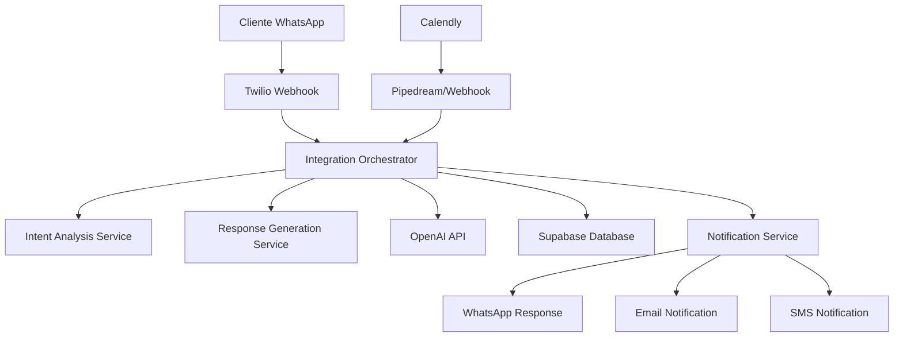
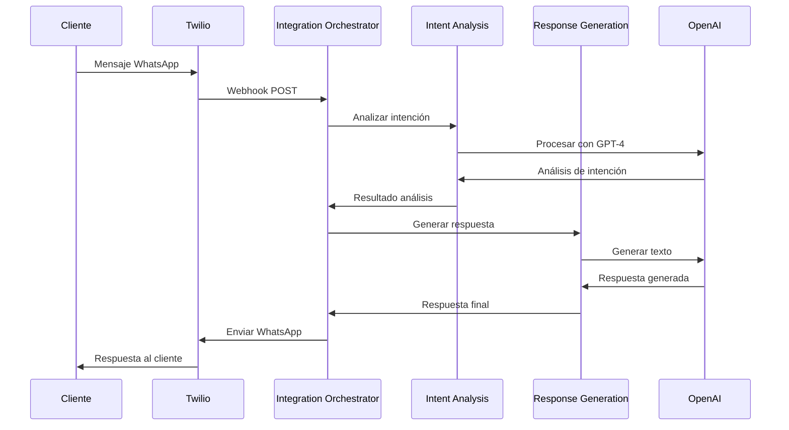
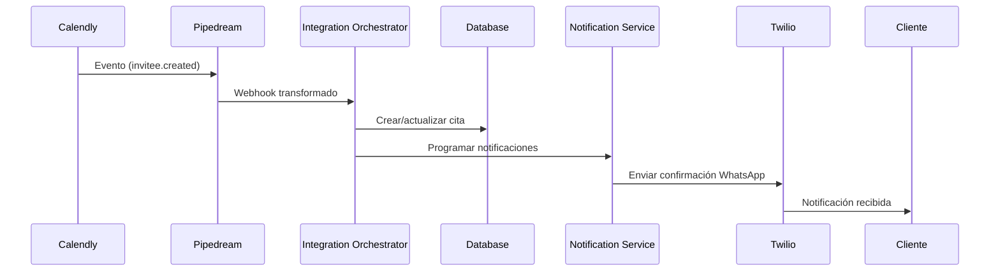

# 🚀 Guía Completa de Integración Calendly-Twilio-OpenAI

## 📋 Resumen Ejecutivo

Esta guía documenta la integración completa entre **Calendly**, **Twilio WhatsApp**, y **OpenAI** para el sistema Asistente RB. La integración permite:

- ✅ **Reservas automáticas** desde WhatsApp
- ✅ **Notificaciones inteligentes** por WhatsApp
- ✅ **Procesamiento de eventos** de Calendly
- ✅ **Respuestas con IA** contextual
- ✅ **Gestión completa** del ciclo de vida de citas

## 🏗️ Arquitectura del Sistema



## 🔧 Componentes Principales

### 1. Integration Orchestrator

**Archivo:** `src/services/integrationOrchestrator.js`

Orquestador principal que coordina todos los servicios:

```javascript
// Procesar mensaje de WhatsApp
const result = await integrationOrchestrator.processWhatsAppMessage(
  phoneNumber,
  message,
  messageId
);

// Procesar evento de Calendly
const result = await integrationOrchestrator.processCalendlyEvent(
  eventType,
  payload
);
```

### 2. Intent Analysis Service

**Archivo:** `src/services/intentAnalysisService.js`

Analiza la intención del usuario usando OpenAI:

```javascript
const analysis = await intentAnalysisService.analyzeMessage(
  message,
  context,
  clientPhone
);

// Resultado:
{
  intent: "booking_request",
  confidence: 0.85,
  entities: {
    service: "Corte y Peinado",
    date: "2024-01-15",
    time: "10:00"
  },
  ready_to_book: true
}
```

### 3. Response Generation Service

**Archivo:** `src/services/responseGenerationService.js`

Genera respuestas inteligentes basadas en el análisis:

```javascript
const response = await responseGenerationService.generateResponse(
  analysis,
  message,
  client,
  context
);
```

### 4. Controladores Especializados

#### WhatsApp Controller

**Archivo:** `src/controllers/whatsappController.js`

```javascript
// Webhook principal
POST / webhook / whatsapp;

// Envío manual de mensajes
POST / api / whatsapp / send;

// Estado de salud
GET / api / whatsapp / health;
```

#### Calendly Webhook Controller

**Archivo:** `src/controllers/calendlyWebhookController.js`

```javascript
// Webhook principal
POST / api / calendly / webhook;

// Verificación
GET / api / calendly / webhook;

// Estado de salud
GET / api / calendly / health;
```

## 🔄 Flujos de Integración

### Flujo 1: Mensaje de WhatsApp → Respuesta IA



### Flujo 2: Evento Calendly → Notificación WhatsApp



## 🛠️ Configuración Paso a Paso

### Paso 1: Variables de Entorno

Crear archivo `.env.local`:

```bash
# Base de datos
SUPABASE_URL=https://tu-proyecto.supabase.co
SUPABASE_SERVICE_KEY=tu_service_key

# OpenAI
OPENAI_API_KEY=sk-proj-tu_api_key
OPENAI_MODEL=gpt-4-turbo

# Twilio
TWILIO_ACCOUNT_SID=ACxxxxxxxxxxxxxxxxxxxxxxxxxxxxxxxx
TWILIO_AUTH_TOKEN=tu_auth_token
TWILIO_WHATSAPP_NUMBER=whatsapp:+14155238886

# Calendly
CALENDLY_ACCESS_TOKEN=tu_access_token
CALENDLY_USER_URI=https://api.calendly.com/users/tu_user_id
CALENDLY_WEBHOOK_URI=https://tu-dominio.com/api/calendly/webhook

# Seguridad
JWT_SECRET=tu_jwt_secret_muy_largo_y_seguro
TWILIO_WEBHOOK_URL=https://tu-dominio.com/webhook/whatsapp
```

### Paso 2: Configurar Base de Datos

```bash
# Ejecutar script de creación de tablas
node scripts/create_missing_tables.sql
```

O ejecutar el SQL directamente en Supabase:

```sql
-- Ver archivo: scripts/create_missing_tables.sql
```

### Paso 3: Configurar Webhooks

#### Twilio WhatsApp

1. Ir a Twilio Console → Messaging → Settings → WhatsApp sandbox
2. Configurar webhook URL: `https://tu-dominio.com/webhook/whatsapp`
3. Método: POST
4. Eventos: Incoming messages

#### Calendly con Pipedream

1. Crear workflow en Pipedream
2. Trigger: HTTP/Webhook
3. Configurar en Calendly: URL de Pipedream
4. Eventos: `invitee.created`, `invitee.canceled`
5. Reenviar a: `https://tu-dominio.com/api/calendly/webhook`

### Paso 4: Verificar Configuración

```bash
# Verificación completa
node scripts/setup_complete_integration.js

# Solo health check
node test_integration_complete.js --health-only
```

## 📡 Endpoints de API

### WhatsApp API

```http
# Webhook principal (Twilio)
POST /webhook/whatsapp
Content-Type: application/x-www-form-urlencoded

# Enviar mensaje manual
POST /api/whatsapp/send
Authorization: Bearer <token>
Content-Type: application/json
{
  "to": "+34600123456",
  "message": "Hola, ¿cómo estás?"
}

# Estado de salud
GET /api/whatsapp/health

# Configuración
GET /api/whatsapp/config
Authorization: Bearer <token>

# Estadísticas
GET /api/whatsapp/stats
Authorization: Bearer <token>
```

### Calendly API

```http
# Webhook principal
POST /api/calendly/webhook
Content-Type: application/json
{
  "event": "invitee.created",
  "payload": { ... }
}

# Verificación de webhook
GET /api/calendly/webhook

# Estado de salud
GET /api/calendly/health

# Sincronización manual
POST /api/calendly/sync
Authorization: Bearer <token>

# Obtener eventos
GET /api/calendly/events
Authorization: Bearer <token>
```

## 🧪 Testing y Debugging

### Scripts de Prueba

```bash
# Prueba completa de integración
node test_integration_complete.js

# Solo verificación de salud
node test_integration_complete.js --health-only

# Configuración de Pipedream
node scripts/setup_pipedream_calendly.js

# Probar webhook existente
node scripts/setup_pipedream_calendly.js --test-webhook
```

### Logs y Monitoreo

Los logs se encuentran en:

- **Consola:** Logs en tiempo real
- **Winston:** Archivos de log estructurados
- **Supabase:** Logs de base de datos

Niveles de log:

- `ERROR`: Errores críticos
- `WARN`: Advertencias
- `INFO`: Información general
- `DEBUG`: Información detallada

### Debugging Común

#### Error: "OpenAI health check failed"

```bash
# Verificar API key
echo $OPENAI_API_KEY

# Probar manualmente
curl -H "Authorization: Bearer $OPENAI_API_KEY" \
     -H "Content-Type: application/json" \
     -d '{"model":"gpt-3.5-turbo","messages":[{"role":"user","content":"test"}],"max_tokens":5}' \
     https://api.openai.com/v1/chat/completions
```

#### Error: "Twilio health check failed"

```bash
# Verificar credenciales
curl -X GET "https://api.twilio.com/2010-04-01/Accounts/$TWILIO_ACCOUNT_SID.json" \
     -u $TWILIO_ACCOUNT_SID:$TWILIO_AUTH_TOKEN
```

#### Error: "Database connection failed"

```bash
# Verificar conexión a Supabase
curl -H "apikey: $SUPABASE_ANON_KEY" \
     -H "Authorization: Bearer $SUPABASE_SERVICE_KEY" \
     "$SUPABASE_URL/rest/v1/services?select=count"
```

## 🔒 Seguridad

### Validación de Webhooks

```javascript
// Twilio signature validation
const crypto = require("crypto");

function validateTwilioSignature(req) {
  const twilioSignature = req.headers["x-twilio-signature"];
  const url = `${req.protocol}://${req.get("host")}${req.originalUrl}`;

  const expectedSignature = crypto
    .createHmac("sha1", TWILIO_WEBHOOK_SIGNING_KEY)
    .update(url + JSON.stringify(req.body))
    .digest("base64");

  return crypto.timingSafeEqual(
    Buffer.from(twilioSignature),
    Buffer.from(`sha1=${expectedSignature}`)
  );
}
```

### Rate Limiting

```javascript
// Configuración por endpoint
const rateLimiters = {
  whatsapp: rateLimit({ windowMs: 60000, max: 30 }),
  general: rateLimit({ windowMs: 60000, max: 100 }),
  admin: rateLimit({ windowMs: 60000, max: 200 }),
};
```

### Sanitización de Datos

```javascript
// Sanitización automática
app.use(SecurityMiddleware.sanitizeInput);
app.use(SecurityMiddleware.validateJsonContent);
```

## 📊 Monitoreo y Métricas

### Health Checks

```javascript
// Verificación automática cada 5 minutos
const healthCheck = await integrationOrchestrator.performHealthChecks();

// Resultado:
{
  allHealthy: true,
  results: {
    openai: true,
    calendly: true,
    twilio: true,
    database: true
  },
  timestamp: "2024-01-15T10:00:00Z"
}
```

### Métricas Clave

- **Mensajes procesados/hora**
- **Tiempo de respuesta promedio**
- **Tasa de éxito de intenciones**
- **Conversiones a citas**
- **Errores por servicio**

## 🚀 Despliegue

### Railway (Producción)

```bash
# Configurar Railway CLI
npm install -g @railway/cli
railway login

# Desplegar
railway up

# Variables de entorno
railway variables set OPENAI_API_KEY=sk-proj-...
railway variables set TWILIO_ACCOUNT_SID=AC...
```

### Ngrok (Desarrollo)

```bash
# Instalar ngrok
npm install -g ngrok

# Exponer puerto local
ngrok http 3000

# Actualizar webhooks con URL de ngrok
```

## 📚 Recursos Adicionales

### Documentación de APIs

- [OpenAI API](https://platform.openai.com/docs)
- [Twilio WhatsApp API](https://www.twilio.com/docs/whatsapp)
- [Calendly API](https://developer.calendly.com/)
- [Supabase API](https://supabase.com/docs)

### Herramientas de Desarrollo

- [Pipedream](https://pipedream.com/) - Workflow automation
- [Postman](https://www.postman.com/) - API testing
- [ngrok](https://ngrok.com/) - Local tunneling

### Comunidad y Soporte

- [GitHub Issues](https://github.com/tu-repo/issues)
- [Discord Community](#)
- [Documentation Wiki](#)

---

## 🎯 Próximos Pasos

1. **Completar configuración** de base de datos
2. **Configurar Pipedream** para Calendly
3. **Probar flujo completo** de reserva
4. **Implementar métricas** avanzadas
5. **Optimizar respuestas** de IA
6. **Agregar más integraciones** (Google Calendar, etc.)

---

**Última actualización:** Enero 2024
**Versión:** 1.0.0
**Autor:** Ricardo Buriticá
